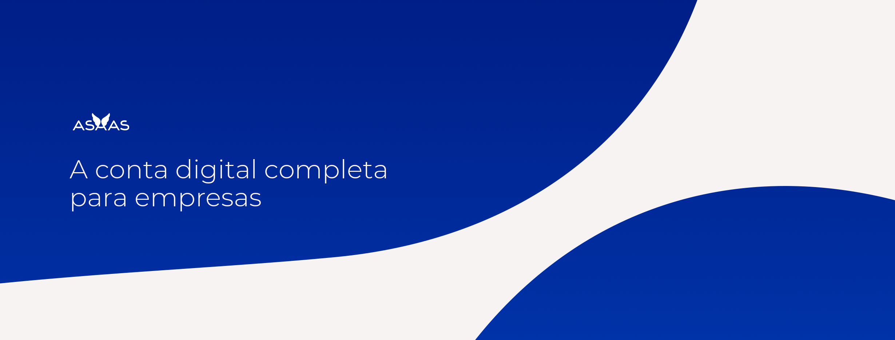

# Mini Asaas




<p>
    O projeto Mini Asaas consiste em um sistema de gerenciamento de cobranças, com foco didático, inispirado no <a href='https://www.asaas.com/' target='_blank'>Asaas</a>.
</p>

<ul>
    <li><a href="#💻-pré-requisitos">💻 Pré-requisitos</a></li>
    <li><a href="#🚀-instalando-o-mini-asaas">🚀 Instalando o Mini Asaas</a></li>
    <li><a href="#☕-usando-o-mini-asaas">☕ Usando o Mini Asaas</a></li>
    <li><a href="#🛠-tecnologias">🛠 Tecnologias</a></li>
    <li><a href="#🌭-funcionalidades">🌭 Funcionalidades</a></li>
</ul>


## 💻 Pré-requisitos

Antes de começar, verifique se você atendeu aos seguintes requisitos:

- O projeto ainda não possui pré-requisitos.

## 🚀 Instalando o Mini Asaas

Para instalar o Mini Asaas, siga estas etapas:

Linux e macOS:

```
O sistema ainda está em desenvolvimento.
```

Windows:

```
O sistema ainda está em desenvolvimento.
```

## ☕ Usando o Mini Asaas

Para usar o Mini Asaas, siga estas etapas:

```
O sistema ainda está em desenvolvimento.
```

## 🛠 Tecnologias

O sistema ainda está em desenvolvimento.

## 🌭 Funcionalidades

O sistema ainda está em desenvolvimento.